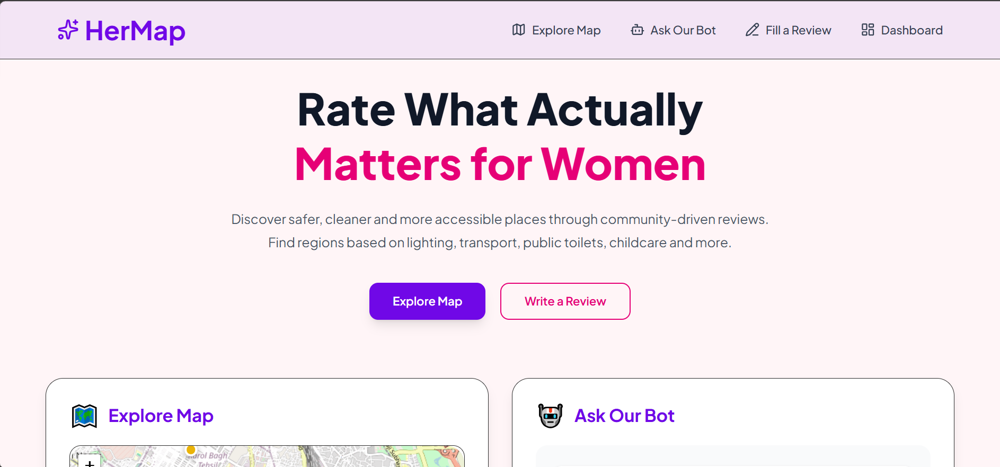
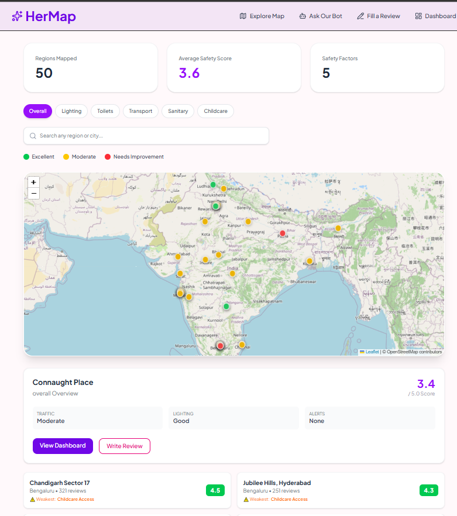
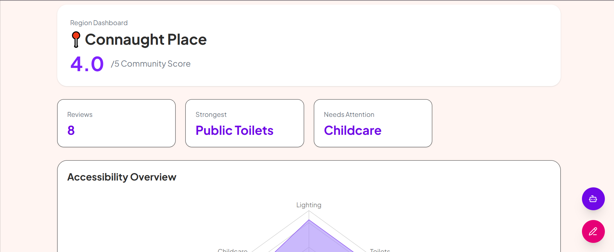
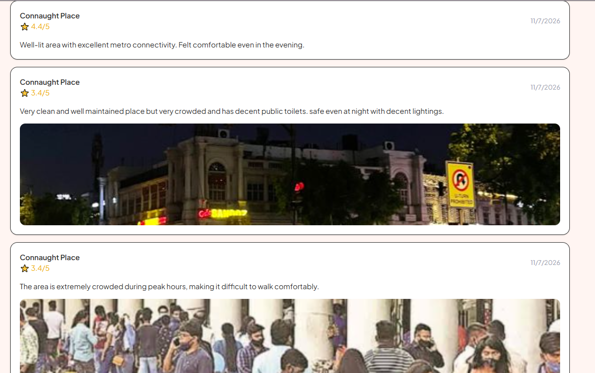
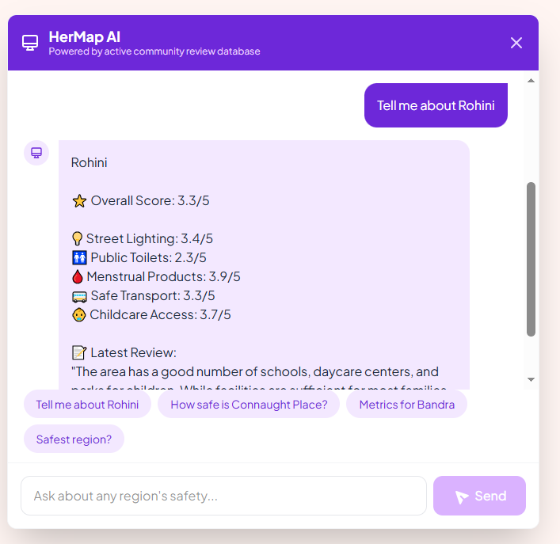

# 🌸 HerMap

> Community-driven accessibility insights for women.

HerMap is a web platform that helps women discover safer and more accessible public spaces through community-powered reviews and AI-assisted insights.

Built for the **IEEE SHE Aspire Hackathon**.

---

## ✨ Features

### 🗺 Interactive Map

- Browse regions on an interactive map
- View accessibility ratings
- Explore community insights

---

### 📊 Region Dashboard

- Overall accessibility score
- Radar chart visualization
- Community statistics
- Recent reviews

---

### ✍ Community Reviews

Users can rate locations based on:

- 💡 Street Lighting
- 🚻 Public Toilets
- 🩸 Menstrual Product Availability
- 🚌 Safe Transport
- 👶 Childcare Access

Optional:

- Comments
- Photo upload

---

### 🤖 AI Assistant

Ask questions like:

- Compare Delhi and Bangalore
- Which region has better lighting?
- Suggest safer areas nearby

---

## 🛠 Tech Stack

- Next.js 15
- React
- TypeScript
- Tailwind CSS
- Leaflet
- React Leaflet
- Recharts
- Firebase (planned)
- Gemini API (planned)

---

## 📂 Project Structure
src/
│
├── app/
├── components/
├── constants/
├── data/
├── hooks/
├── lib/


---

## 🚀 Getting Started

Clone the repository

```bash
git clone https://github.com/YOUR_USERNAME/hermap.git
npm install
npm run dev
```
---
📸 Screenshots
##Home

##Map

##dashboard


##Review Form

##HerBOt

---